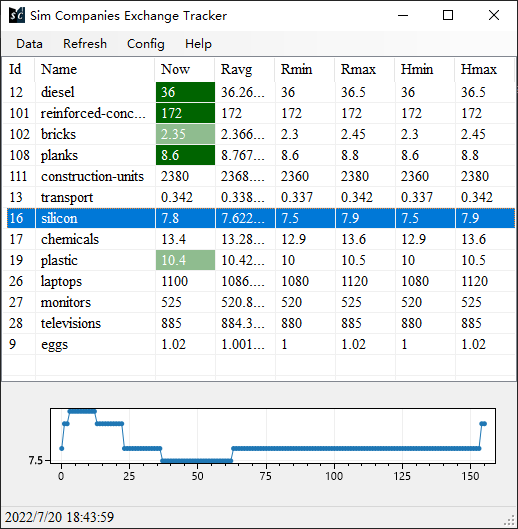

#  Sim Companies Exchange Tracker

The Exchange Tracker of the [Sim Companies](https://www.simcompanies.com/) on .NET 6.0 platform, based on [Web API](https://www.simcompanies.com/articles/api). 

## Features

- Auto refresh the exchange information, with customizable time interval.
- Customize the list of your favourite products.
- Record recent and historic lowest/highest price.
- Change the color of text to notify if the current price of a product is lower than min/average price.

## How to use

1. Unzip the [releases file](https://github.com/bac0id/simcompanies-exchange-tracker/releases).
3. Run the executive file. 
4. If you wanna quit but save the recorded prices so far, click "Data-Save history" menu in program. If you wanna retrieve this data, click "Data-Load history".

## Useful links

- [Product ID list]docs/product-id-list.md)

## License

This repository is under MIT License. 

The icon of runnable file is licensed by Sim Companies. 
